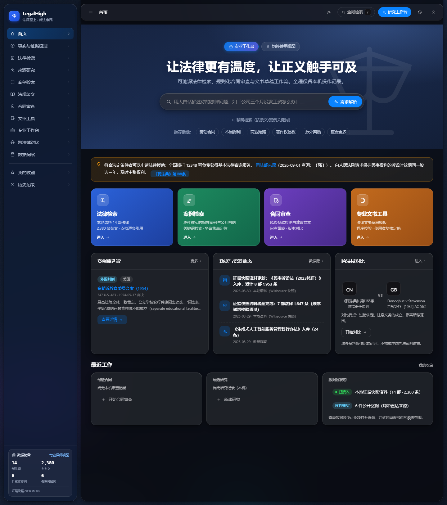
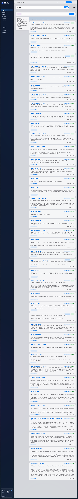
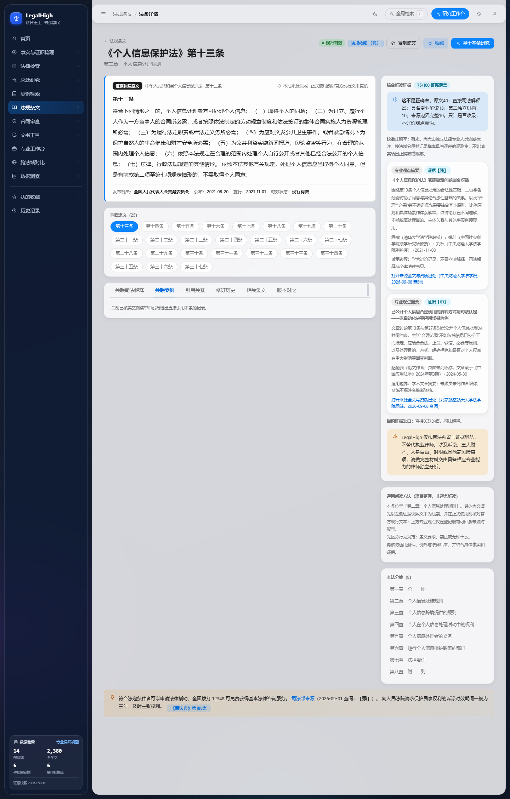
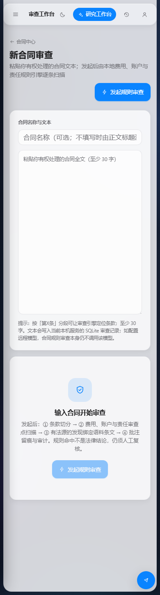
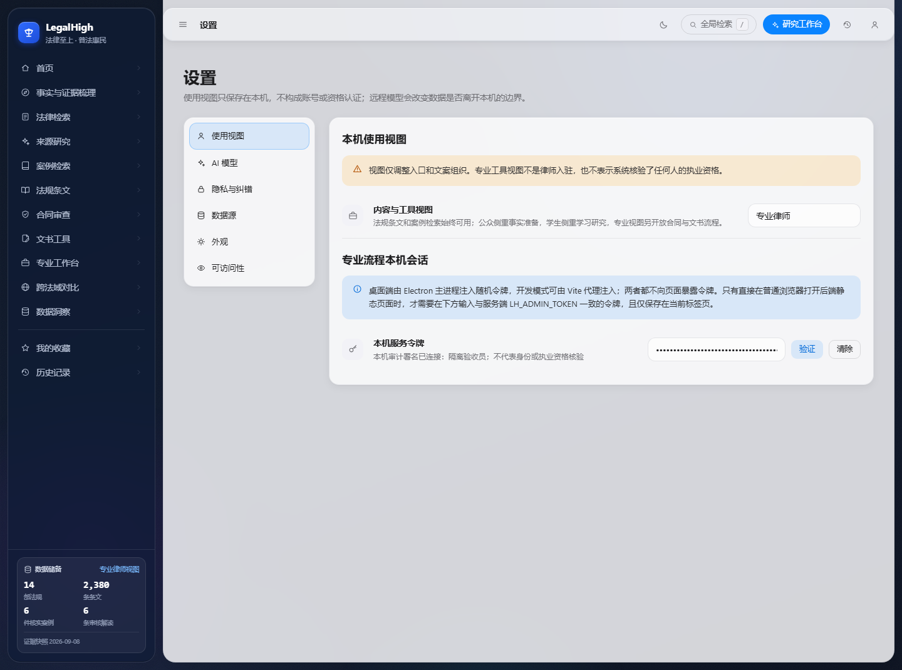

# LegalHigh (English)

[简体中文](README.zh-CN.md) · [Project index](README.md) · [Security](SECURITY.md) · [Contributing](CONTRIBUTING.md)

[Browse statutes online](https://rethymus.github.io/LegalHigh/) · [v1.1.0-rc.1 prerelease](https://github.com/Rethymus/LegalHigh/releases/tag/v1.1.0-rc.1) · [Changelog](CHANGELOG.md)

## Installation and release choice

GitHub Pages provides static statute browsing and product information. Full retrieval, fact preparation, contract review, drafts, professional commentary and optional AI require the local Python backend described below. The release includes source and a static-site ZIP with SHA-256 checksums. The static ZIP is not a desktop installer. v1.1.0-rc.1 is a prerelease; signed installation checks across all three desktop platforms remain incomplete. Old v1.0.0 installers lack subsequent fixes.

Before upgrading, back up local SQLite, preserve provider configuration and stop the old service. Install dependencies from the new lockfiles and restart. Legacy verified/issued drafts migrate to reviewed/finalized, which record local user progress only. To roll back, restore the pre-upgrade database backup instead of opening a migrated database with the old application.

LegalHigh is a local-first prototype for traceable legal information and document assistance. It combines evidence snapshots, verified case records, deterministic retrieval, contract rules, document templates, human-review gates, and audit records in one inspectable workflow.

It is not a law firm, does not practise law, does not provide legal advice, and does not predict case outcomes. High-risk outputs must be independently reviewed outside the platform by an authorized and appropriately qualified person. The platform only records the local user's own review/finalize progress; it does not verify credentials and does not issue documents.

## Who it serves and how

The full application requires an explicit local view choice on first use; it no longer silently assigns a default audience and does not collect a name. Users can switch later under Settings → Usage View. Statute and case search are always available. Research, learning, and comparative-law entry points are shown where relevant. Contract review, document drafts, the professional workspace, and operational audit are shown only in the Professional Lawyer view, and direct URLs are gated as well. “Professional Lawyer” is a presentation choice—not account, licence, or organization verification.

- Members of the public: use the six-step Fact & Evidence Preparation flow to record the trigger, chronology, actual outcome, parties, available materials, desired outcome, and open questions. Retrieval uses only reported facts. Candidate issue directions quote their factual basis, remain explicitly provisional, and never silently default to a claim model. The result is ephemeral unless the user exports the JSON and can then be taken to legal-aid staff or independent counsel.
- Law students: study source-linked provisions, verified case records, citation chains, and explicit retrieval gaps while keeping comparative foreign judgments separate from Chinese legal authority.
- Professional users: run local contract rules over fee, account, and liability terms, preserve annotation/audit history, and create practical drafts of lawyer letters, contracts, and litigation documents. Firm, lawyer, and licence fields are supplied by the user; LegalHigh neither verifies them nor issues the document.

LegalHigh does not provide lawyer onboarding, referrals, assignment, online consultation, credential verification, or platform issuance. It is a legal-literacy and fact-preparation tool before independent professional assistance, plus an inspectable research, review, and drafting aid.

## Screenshots

Captured on 2026-09-08 using an isolated local backend. These are full-stack screenshots; GitHub Pages provides only the static subset.

| Home (light) | Home (dark) |
|---|---|
|  |  |

| Statute search | Statute detail |
|---|---|
|  |  |

| Contract review | Settings · appearance (segmented control) |
|---|---|
|  |  |

Motion exists only on real product interactions: toast, dialog, segmented-control, switch, list, and scroll-navigation behavior is probed in a headless browser. Reduced motion, keyboard focus, contrast, and timing are QA gates. No internal design-specification or component-gallery page is exposed to end users.

## What currently works

| Capability | Honest boundary |
|---|---|
| Fact and evidence preparation | Six steps capture trigger, chronology, outcome, parties, materials, and questions. Candidate directions expose the exact user-reported basis and remain “unknown” when unsupported. Desired outcomes and questions do not contaminate fact retrieval. Results are not auto-saved and may be exported by the user. |
| Claim-element check | Runs only after the user explicitly selects a candidate claim model; there is no default loan model. It reports only whether a clue appears in the supplied text, links each element to the original excerpt and current provision, and makes no cause-of-action, entitlement, or outcome determination. |
| Statute browsing and BM25 search | Built from repository evidence snapshots. The current build contains 14 instruments and 2,380 provisions, adding official NPC snapshots of the Personal Information Protection Law, Legal Aid Law, Administrative Reconsideration Law, and Administrative Litigation Law. The NPC's 16 March 2026 catalogue lists 310 currently effective laws; its scope differs from this mixed controlled corpus. LegalHigh is neither a complete Chinese-law database nor a historical-version service. |
| Citation-style Q&A | Deterministic retrieval returns source-text cards. A tested rule set can flag a small number of false premises. Missing evidence is reported as a gap. |
| Case search | Only records with a direct source, verification date, and evidence grade are exposed. Foreign judgments are comparative material, never Chinese adjudicative authority. |
| Live inventory | The sidebar footer calls the public read-only `/api/inventory` endpoint. Counts are derived from the current controlled corpus, verified cases, and approved explanations; user reviews, drafts, complaints, and audit records are neither read nor exposed, and no fictional user identity is displayed. |
| Contract review | Local rules scan text supplied by the user and create review records, annotation states, and a DOCX revision file. The result is not a lawyer's opinion. No fictional client contracts are shipped. |
| Document drafting | User input and fixed templates create a draft and validation report. `reviewed` and `finalized` record only the local user's own progress and explicit responsibility confirmation. They are not credential verification or platform issuance. |
| Optional AI provider | Disabled by default. Requests leave the device only after explicit configuration and authorization. A custom public endpoint must match a server-side host allowlist. The server first injects provision text, directly linked judicial interpretations, and registered summaries of named professional commentary; client-supplied system messages cannot override those evidence rules. Generated text is withheld when citation gates fail. Calibrated accuracy remains “unavailable” until an independent lawyer-labelled evaluation set exists; the separately labelled evidence-coverage score is explicitly not accuracy. |
| Privacy and audit | SQLite is local by default. Sensitive export, deletion, review/finalize transitions, and content-publication review require a server-authenticated local principal. The project has no multi-user tenant model and is unsuitable for shared public hosting. |

## Claims this repository does not make

- It has not demonstrated completion of any production filing, algorithm registration, generative-AI registration, legal-services licence, or signed production release.
- The Pages workflow runs on main-branch pushes or manual dispatch and builds a static statute-browsing frontend only. Contract, drafting, audit, AI, and privacy APIs do not run on the static site.
- The desktop workflow creates artifacts named `unsigned-desktop-candidate-*` and does not publish a Release. This local audit is not proof that signed installers for all three operating systems have been published and tested.
- Repository snapshots are not an official national legal database. Verify the linked authoritative publication before formal reliance.
- Passing tests and audits proves only the covered assertions; it cannot establish that the system never fails.

## Evidence discipline

Raw evidence lives under `docs/research/evidence/`. `server/build_corpus.py` is the only supported path into `server/data/laws/`. The build records source URLs, dates, evidence grades, source and output SHA-256 hashes, and effective/version-date evidence. `server/scripts/corpus_selfcheck.py` checks structure, numbering, hashes, and date evidence. Machine checks do not replace comparison with the authoritative text.

Case facts and summaries are project-authored structured restatements, not full judgments. Every case page links to its source. Data without clear reuse permission must not be copied into the product; an unused LawRefBook-derived corpus was removed because its upstream repository did not provide a licence.

Professional commentary stores only named authors, verifiable credentials, source URLs, access dates, project-authored summaries, and scope limits. Full text is not copied without permission. Academic opinion and binding or official interpretation remain visibly separate.

## Development

Requirements: Python 3.12, Node.js 22, and npm.

```bash
cd server
python3.12 -m venv .venv
.venv/bin/python -m pip install --require-hashes -r requirements-dev.lock
.venv/bin/python build_corpus.py
.venv/bin/python -m uvicorn app.main:app --host 127.0.0.1 --port 8000
```

On Windows, replace `.venv/bin/python` with `.venv\Scripts\python.exe`.

```bash
cd web
npm ci
npm run dev
```

Do not bind the development API to a public interface. Sensitive endpoints require an `LH_ADMIN_TOKEN` of at least 32 characters in the `X-LegalHigh-Admin-Token` header. The audit label comes from server-side `LH_ADMIN_PRINCIPAL`, never the request body; it identifies a local operation only and is not proof of identity, organization, or professional qualification.

For the desktop shell:

```bash
cd desktop
npm ci
npm run check
```

The Electron main process allocates a random loopback port, token, and instance proof. The sandboxed renderer never receives the admin token, and SQLite is stored in the operating-system user-data directory rather than installation resources. A full installer build additionally requires the platform-specific PyInstaller sidecar.

## Verification

Use a unique `LH_DB_PATH` for integration runs. `server/scripts/final_verify.py` creates and cleans its own temporary SQLite database by default; it refuses to write to a running service unless loopback and explicit write authorization are both supplied.

```bash
cd server
.venv/bin/python -m pytest tests -q
.venv/bin/python scripts/corpus_selfcheck.py
.venv/bin/python scripts/final_verify.py

cd ../web
npm run build
node scripts/qa_gates.mjs
node scripts/qa_contrast.mjs --strict
```

Python runtime, development, and desktop-build lock files include exact versions and download hashes. Web and Electron dependencies use committed npm lockfiles and CI uses `npm ci`.

## Security boundary

- The API restricts browser origins and emits security headers.
- Custom AI endpoints require HTTPS, a public address, and a server-side exact-host allowlist; private, loopback, link-local, and metadata targets are blocked. The fixed local development endpoint cannot receive a user key.
- DOCX returns are bounded by upload size, ZIP structure, and decompressed size and return a 4xx response for malformed input.
- Local favourites, browse history, and research marks are schema-checked before use.
- Current authentication is a single-machine administrator boundary, not a production identity, tenant, or ownership model. Public deployment requires a new authentication/authorization, CSRF, secret-management, and data-isolation design.

## Prior art and research references

On 2026-09-08, we also checked [CourtListener](https://github.com/freelawproject/courtlistener) for repository organization, contribution and rights documentation, and [docassemble](https://github.com/jhpyle/docassemble) for its guided-interview scope and documentation entry points. This release adopts explicit edition links, a changelog, upgrade guidance and precise asset descriptions. Evidence grade: strong (official project repositories). No endorsement, code or data transfer is implied.

The project consulted [LegalBench-RAG](https://github.com/ZeroEntropy-AI/legalbenchrag) for retrieval-only deterministic evaluation, [LegalBench](https://hazyresearch.stanford.edu/legalbench/tasks/) and [LawBench](https://github.com/open-compass/LawBench) for task matrices and abstention-aware evaluation, [DISC-LawLLM](https://github.com/FudanDISC/DISC-LawLLM) for verifiable-retrieval boundaries, and [CUAD](https://github.com/TheAtticusProject/cuad) for expert-labelled contract-review task categories. No code, model, contract corpus, or dataset from those projects is imported here. Dataset licences remain task-specific and must not be treated as one uniform permission. These primary project sources were checked on 2026-09-07 and are graded strong evidence for their own project descriptions.

See [THIRD_PARTY_NOTICES.md](THIRD_PARTY_NOTICES.md) for licensing boundaries.

## Disclaimer and licence status

LegalHigh is for legal-information research and software validation. Outputs may be incomplete, outdated, or wrong. Verify the latest authoritative publication and obtain qualified professional advice for a real matter.

This repository currently has no open-source licence. No permission to copy, modify, distribute, or use the code commercially is granted by publication alone. Legal texts, judgments, dependencies, and third-party materials remain subject to their respective sources and terms.
