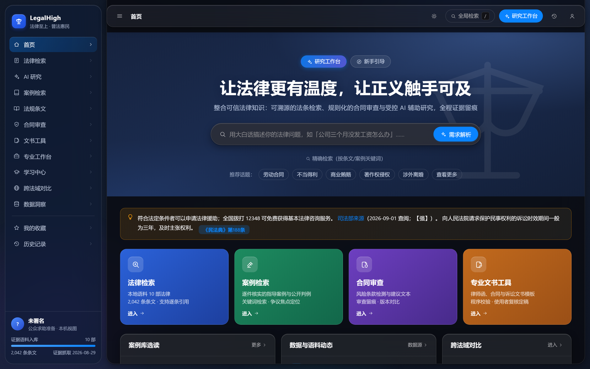
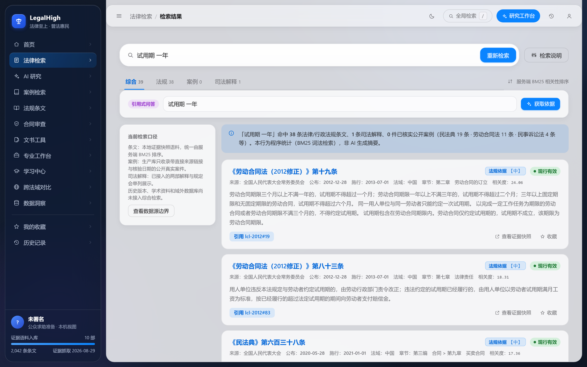
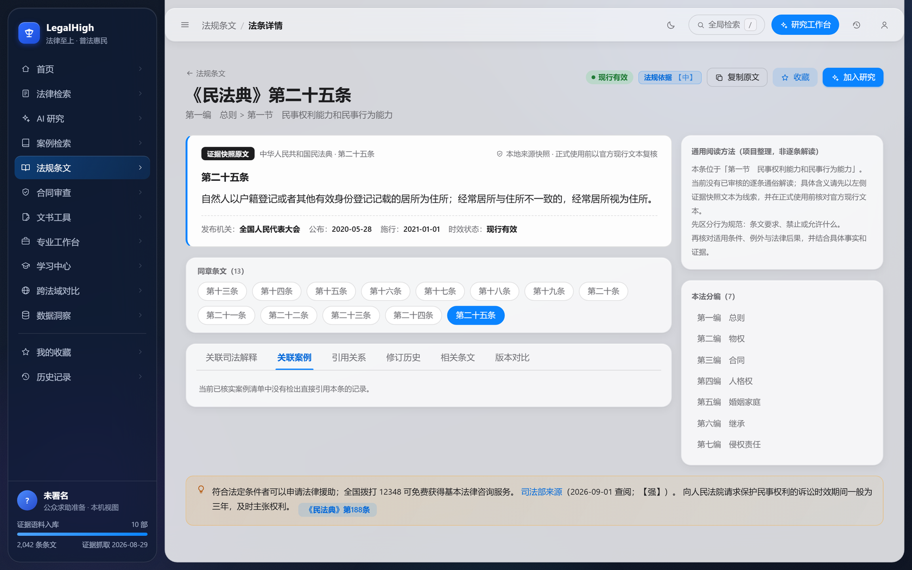
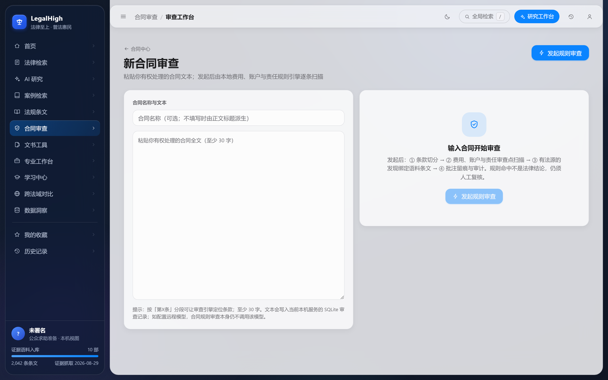
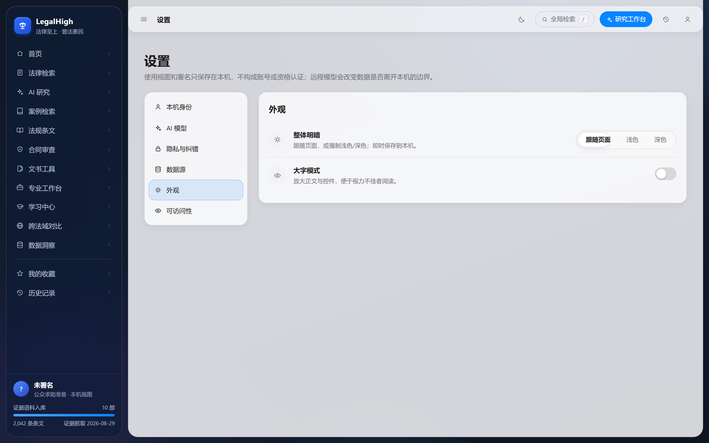
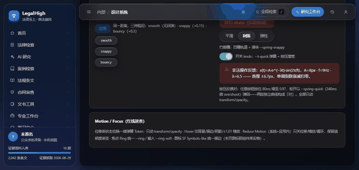

# LegalHigh (English)

[简体中文](README.zh-CN.md) · [Project index](README.md) · [Security](SECURITY.md) · [Contributing](CONTRIBUTING.md)

LegalHigh is a local-first prototype for traceable legal information and document assistance. It combines evidence snapshots, verified case records, deterministic retrieval, contract rules, document templates, human-review gates, and audit records in one inspectable workflow.

It is not a law firm, does not practise law, does not provide legal advice, and does not predict case outcomes. High-risk outputs must be independently reviewed outside the platform by an authorized and appropriately qualified person. The platform only records the local user's own review/finalize progress; it does not verify credentials and does not issue documents.

## Screenshots

Captured on 2026-09-06 from a locally running full stack (real API-driven UI; sample content is labeled as such):

| Home (light) | Home (dark) |
|---|---|
|  |  |

| Statute search | Statute detail |
|---|---|
|  |  |

| Contract review | Settings · appearance (segmented control) |
|---|---|
|  |  |

Motion system (CSS `linear()` curves derived from the SwiftUI spring model): three springs over the same distance, spring-in toast, exponentially-decaying shake, and a spring-loaded segmented control. The gallery is interactive on the internal design-system page, and the physics are asserted headlessly by `web/scripts/qa_motion.mjs` (bouncy overshoot measured 230px ≈ 229px theoretical, smooth with no overshoot, shake decaying to zero):



Materials are tiered by semantics — navigation chrome, content desk, cards, and overlays each get one set of blur, tint, inner-edge light, and hairline parameters (all tokens). The neutral scale `--gray-1..6` shares semantics across light/dark; focus rings, contrast, and motion durations are all gated in QA.

## What currently works

| Capability | Honest boundary |
|---|---|
| Statute browsing and BM25 search | Built from repository evidence snapshots. The current build contains 10 instruments and 2,042 provisions, with source, snapshot date, hashes, and effective/version-date evidence. This is not a complete Chinese-law database or a historical-version service. |
| Citation-style Q&A | Deterministic retrieval returns source-text cards. A tested rule set can flag a small number of false premises. Missing evidence is reported as a gap. |
| Case search | Only records with a direct source, verification date, and evidence grade are exposed. Foreign judgments are comparative material, never Chinese adjudicative authority. |
| Contract review | Local rules scan text supplied by the user and create review records, annotation states, and a DOCX revision file. The result is not a lawyer's opinion. No fictional client contracts are shipped. |
| Document drafting | User input and fixed templates create a draft and validation report. Verification and issuance are protected server-side states; client-supplied identity or role claims are rejected. |
| Optional AI provider | Disabled by default. Requests leave the device only after explicit configuration and authorization. A custom public endpoint must match a server-side host allowlist. Generated text is withheld when citation gates fail. |
| Privacy and audit | SQLite is local by default. Sensitive export, deletion, verification, and issuance require a server-authenticated principal. The project has no multi-user tenant model and is unsuitable for shared public hosting. |

## Claims this repository does not make

- It has not demonstrated completion of any production filing, algorithm registration, generative-AI registration, legal-services licence, or signed production release.
- The manually triggered Pages workflow builds a static statute-browsing frontend only. Contract, drafting, audit, AI, and privacy APIs do not run on the static site.
- The desktop workflow creates artifacts named `unsigned-desktop-candidate-*` and does not publish a Release. This local audit is not proof that signed installers for all three operating systems have been published and tested.
- Repository snapshots are not an official national legal database. Verify the linked authoritative publication before formal reliance.
- Passing tests and audits proves only the covered assertions; it cannot establish that the system never fails.

## Evidence discipline

Raw evidence lives under `docs/research/evidence/`. `server/build_corpus.py` is the only supported path into `server/data/laws/`. The build records source URLs, dates, evidence grades, source and output SHA-256 hashes, and effective/version-date evidence. `server/scripts/corpus_selfcheck.py` checks structure, numbering, hashes, and date evidence. Machine checks do not replace comparison with the authoritative text.

Case facts and summaries are project-authored structured restatements, not full judgments. Every case page links to its source. Data without clear reuse permission must not be copied into the product; an unused LawRefBook-derived corpus was removed because its upstream repository did not provide a licence.

## Development

Requirements: Python 3.12, Node.js 22, and npm.

```bash
cd server
python3.12 -m venv .venv
.venv/bin/python -m pip install --require-hashes -r requirements-dev.lock
.venv/bin/python build_corpus.py
.venv/bin/python -m uvicorn app.main:app --host 127.0.0.1 --port 8000
```

On Windows, replace `.venv/bin/python` with `.venv\Scripts\python.exe`.

```bash
cd web
npm ci
npm run dev
```

Do not bind the development API to a public interface. Sensitive endpoints require an `LH_ADMIN_TOKEN` of at least 32 characters in the `X-LegalHigh-Admin-Token` header. Principal, role, and lawyer licence metadata must come from the server environment, never the request body.

For the desktop shell:

```bash
cd desktop
npm ci
npm run check
```

The Electron main process allocates a random loopback port, token, and instance proof. The sandboxed renderer never receives the admin token, and SQLite is stored in the operating-system user-data directory rather than installation resources. A full installer build additionally requires the platform-specific PyInstaller sidecar.

## Verification

Use a unique `LH_DB_PATH` for integration runs. `server/scripts/final_verify.py` creates and cleans its own temporary SQLite database by default; it refuses to write to a running service unless loopback and explicit write authorization are both supplied.

```bash
cd server
.venv/bin/python -m pytest tests -q
.venv/bin/python scripts/corpus_selfcheck.py
.venv/bin/python scripts/final_verify.py

cd ../web
npm run build
node scripts/qa_gates.mjs
node scripts/qa_contrast.mjs --strict
```

Python runtime, development, and desktop-build lock files include exact versions and download hashes. Web and Electron dependencies use committed npm lockfiles and CI uses `npm ci`.

## Security boundary

- The API restricts browser origins and emits security headers.
- Custom AI endpoints require HTTPS, a public address, and a server-side exact-host allowlist; private, loopback, link-local, and metadata targets are blocked. The fixed local development endpoint cannot receive a user key.
- DOCX returns are bounded by upload size, ZIP structure, and decompressed size and return a 4xx response for malformed input.
- Local favourites, browse history, and research marks are schema-checked before use.
- Current authentication is a single-machine administrator boundary, not a production identity, tenant, or ownership model. Public deployment requires a new authentication/authorization, CSRF, secret-management, and data-isolation design.

## Prior art and research references

The project consulted [LegalBench-RAG](https://github.com/zeroentropy-cc/legalbenchrag), [LegalBench](https://hazyresearch.stanford.edu/legalbench/tasks/), [LawBench](https://github.com/open-compass/LawBench), and [DISC-LawLLM](https://github.com/FudanDISC/DISC-LawLLM) for evaluation methodology and documentation structure. No code, model, or dataset from those projects is imported here. LegalBench tasks have task-specific licences and must not be treated as one uniformly licensed dataset. These primary project sources were checked on 2026-09-02 and are graded strong evidence for their own project descriptions.

See [THIRD_PARTY_NOTICES.md](THIRD_PARTY_NOTICES.md) for licensing boundaries.

## Disclaimer and licence status

LegalHigh is for legal-information research and software validation. Outputs may be incomplete, outdated, or wrong. Verify the latest authoritative publication and obtain qualified professional advice for a real matter.

This repository currently has no open-source licence. No permission to copy, modify, distribute, or use the code commercially is granted by publication alone. Legal texts, judgments, dependencies, and third-party materials remain subject to their respective sources and terms.
